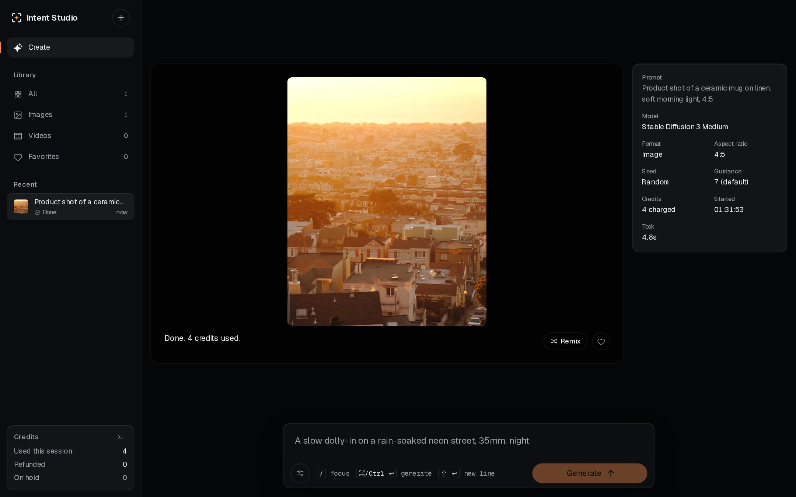
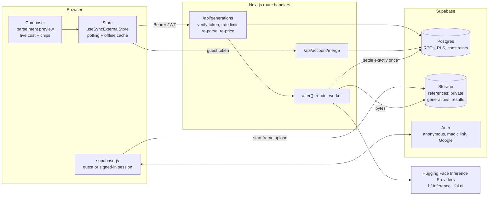
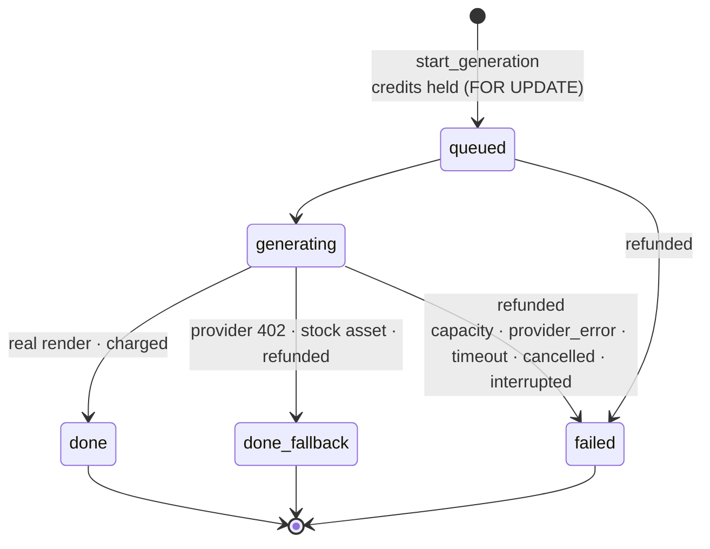
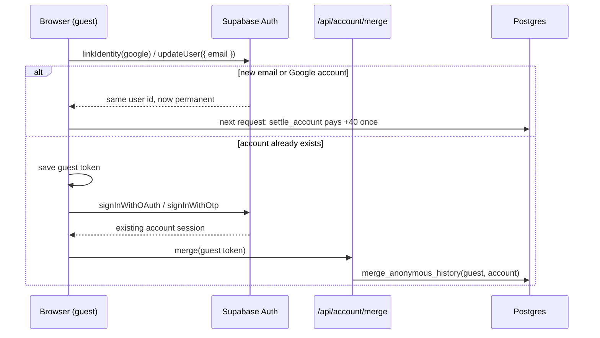

<div align="center">


# Intent Studio

**Describe it. See the exact cost. Failed runs refund themselves.**

An AI image and video studio for marketers, content writers and creative directors.<br>
Write what you want in plain words: Intent Studio reads the format, camera move, aspect ratio and length from your prompt, shows the price before you run it, and returns every credit when a render fails.

[](https://github.com/DevHusnainAi/intent-studio/actions/workflows/ci.yml)
[](LICENSE)
[](e2e/a11y.test.ts)<br>


</div>

---

## Contents

- [Why it exists](#why-it-exists)
- [Features](#features)
- [Architecture](#architecture)
- [Credits you can trust](#credits-you-can-trust)
- [Accounts](#accounts)
- [Security model](#security-model)
- [Resilience](#resilience)
- [Accessibility](#accessibility)
- [Quick start](#quick-start)
- [Configuration](#configuration)
- [Testing](#testing)
- [Project structure](#project-structure)
- [Known limitations](#known-limitations)
- [License and credits](#license-and-credits)

## Why it exists

Creators using today's AI video tools complain less about output quality than about **money and opacity**: credits that drain without a clear price per run, generations that stall or fail and still cost credits, and upgrade walls that appear mid-task ([Trustpilot reviews](https://www.trustpilot.com/review/higgsfield.ai), [a 2026 product review](https://www.pixmax.ai/blog/higgsfield-ai-review.html), [a vendor help page on stuck jobs](https://higgsfield.ai/creator-hub/help-center/troubleshooting/generation-is-stuck-or-failed)).

Intent Studio is built around the opposite promises:

1. **Prompt first.** One text box. No model picker or settings wall before you've said what you want.
2. **Settings follow the prompt.** "Slow dolly-in on coffee, vertical video, 6s" becomes editable chips: *Video · Dolly in · 9:16 · 6s*.
3. **The price is on the button** for every run, computed by the same function the server charges with.
4. **Honest states.** Queued, generating, done, or failed *with the refund stated*. Nothing hangs forever.

## Features

| | |
|---|---|
| **Intent parser** | Reads media type, 16 camera moves, aspect ratio and duration from plain language, negation-aware ("without zooming in"). Every chip can be overridden from a menu. |
| **Exact pricing** | Live cost breakdown in the composer (`1 image × 4 credits = 4`). When you're short, it offers the closest affordable option: fewer outputs, a shorter clip, or a cheaper model. |
| **Batches** | 1 to 4 outputs per run, held in one transaction, refunded per output. |
| **Image-to-video** | Attach a start frame from your private library (10 frames, 5 MB each). |
| **Studio workspace** | Masonry feed of presets, stage + inspector for each run, library with filters and favorites, remix, keyboard shortcuts (`/`, `⌘/Ctrl ↵`). |
| **Accounts** | Try instantly as a guest (8 credits). Sign in with Google or a magic link to keep your history everywhere and get 40 credits. While you wait for the email, the screen completes by itself the moment the link is opened in another tab. Sign-in opens as a modal over the studio, or as a full split page on a direct visit, with Iris, a creature that follows your cursor and watches for your sign-in. |
| **Dev console** | A live, read-only stream of the pipeline: parsed intent, request latency, credit lock timing, state changes. |



<sub>Local mode: the simulated renderer returns a placeholder photo, not a render of the prompt.</sub>

## Architecture



**Key decisions**

- **One parser, two runtimes.** `lib/intent.ts` runs on every keystroke in the browser to show chips and price, and again on the server on the raw prompt plus untrusted overrides. The client never decides what is rendered or what it costs.
- **Money lives in Postgres.** Every write goes through `plpgsql` functions only the server's service role can execute. Clients can read their own rows and nothing else.
- **Auth stays in the browser.** Sessions live in supabase-js, not cookies; API routes verify bearer tokens with the auth server. Server-rendered HTML is identical for every visitor, so auth state can never cause a hydration mismatch.
- **Rules, not an LLM, for parsing.** Predictable, testable, free and fast enough per keystroke. Swapping detection for a model call is isolated to one function.

| Model | Media | Provider | Credits |
|---|---|---|---|
| Stable Diffusion 3 Medium | image | hf-inference | 4 / image |
| FLUX.1 schnell | image | fal.ai | 2 / image |
| Wan 2.2 TI2V-5B | video (text) | fal.ai | 6 / second |
| Wan 2.2 I2V-A14B | video (start frame) | fal.ai | 8 / second |

The rate card is a mock defined once in `lib/models.ts`; client and server read the same registry, so displayed and charged prices can't drift.

## Credits you can trust



The guarantee is enforced three times, independently:

1. **Types.** `Generation` is a discriminated union where credit state is fixed by status. A failed run without a refund doesn't compile.
2. **Database.** The `credits_follow_status` `CHECK` constraint mirrors that union, so even a hand-written `UPDATE` can't produce a failed row without a refund.
3. **Functions.** `start_generation` locks the balance row (`SELECT … FOR UPDATE`), checks the 3-active-runs cap and the balance, then deducts and inserts all outputs in one transaction. `complete_generation` and `fail_generation` match only active rows, so settlement happens exactly once and a late result after a cancel is discarded.

A sweep fails and refunds any run active for more than 10 minutes, on the user's next history fetch.

## Accounts



- **Upgrade in place.** A guest *links* Google or an email to their anonymous user. The user id doesn't change, so history, balance and start frames carry over with no data migration and no RLS change.
- **Existing accounts.** Signing in to an account that already exists switches users. The guest's *finished* runs move across via `merge_anonymous_history`; **credits never move**, and runs still holding credits settle with the guest, so a merge can't launder a refund.
- **Credits.** Guests start with **8**. A permanent account receives **40 exactly once** in its life (`signup_grant_at`), whether it signed up directly or upgraded from a guest.
- **Privacy on shared devices.** The offline history cache records which account owns it; a different account or a sign-out clears it before anything renders, and replies sent as a previous account are dropped.

## Security model

| Threat | Control | Where |
|---|---|---|
| Double spend via concurrent requests | Balance row lock; check and deduction in one transaction | `start_generation` |
| Client-chosen price or settings | Server re-parses the prompt and re-prices; client cost is never read | `app/api/generations/route.ts` |
| IDOR on reads | RLS `select` policies: `(select auth.uid()) = user_id` | `generations`, `user_credits` |
| IDOR on cancel | Ownership checked in the route **and** inside `cancel_generation(id, user)` | `[id]/cancel/route.ts` |
| Direct table writes | No write policies; `INSERT/UPDATE/DELETE` revoked from `anon` and `authenticated` | `…_security_hardening.sql` |
| Privileged functions from the browser | `EXECUTE` granted only to `service_role`; `search_path = ''` | all migrations |
| Credit farming | 8-credit guests, a once-per-account 40 grant, history-only merges, 3 active runs per user | `…_accounts.sql` |
| Forged merge | Server verifies both tokens with the auth server; source must be anonymous, target permanent | `/api/account/merge` |
| Request flooding | 15 writes / 10 min per user **and** per IP, stored in Postgres, fails closed, `429` + `Retry-After` | `rate_limit_hit` |
| Storage exhaustion | Private image-only bucket, 5 MB, an 11th file per folder rejected under a per-folder lock | `…_storage_limits.sql` |
| SSRF via start frames | Path-only contract `<uuid>/<uuid>.(png\|jpg\|webp)`, owner-folder check, bytes sent to the provider, never URLs | `lib/intent.ts`, render worker |
| Wrong server key | A publishable/anon key in `SUPABASE_SECRET_KEY` is refused at startup | `lib/server/supabase.ts` |
| Secret leakage | `SUPABASE_SECRET_KEY`, `HF_TOKEN`, `FAL_KEY` have no `NEXT_PUBLIC_` prefix and are used only in `lib/server/*` | |

## Resilience

| Situation | Behaviour |
|---|---|
| Provider out of credit (**HTTP 402**) | Optional demo fallback: the run completes with a clearly labelled stock asset, **refunded in the same statement**, plus a toast. Only 402 triggers it; set `DEMO_FALLBACK=off` to fail and refund instead. |
| Provider slow or hung | 270s render timeout inside the route's 300s `maxDuration`, then `timeout`, refunded |
| Worker dies mid-render | The stale sweep refunds it on the next history fetch |
| User cancels | Settled and refunded first, then the render is aborted; a late result is discarded |
| Supabase unreachable or misconfigured | A classified, actionable banner; exponential backoff to 60s; cached history stays usable |

## Accessibility

Tested with axe-core in Chromium against **WCAG 2.2 AA** in CI, across the feed, composer, chip menus, Advanced panel, a finished run, the library and the mobile drawer.

- One visible focus style everywhere (2px accent outline with a gap, survives Windows High Contrast), a skip-to-prompt link, and focus never hidden behind the floating composer.
- Chip menus implement the arrow-key behaviour their ARIA roles promise.
- Control borders meet 3:1 contrast; text meets AA on every surface tier.
- No video autoplays; previews play on hover or focus, and nothing moves under `prefers-reduced-motion`.

## Quick start

**No backend:** the whole UI runs in the browser against a simulated renderer.

```bash
git clone https://github.com/DevHusnainAi/intent-studio.git
cd intent-studio
npm install
npm run dev            # http://localhost:3000
```

**With Supabase (local)** requires the [Supabase CLI](https://supabase.com/docs/guides/local-development/cli/getting-started) and Docker:

```bash
supabase start         # Postgres, Auth, Storage; applies every migration
supabase status        # prints the URL and keys for .env.local
cp .env.example .env.local   # fill in the values below
npm run dev
```

Node.js **22.18+** is required (the tests run TypeScript directly with Node's type stripping).

## Configuration

| Variable | Required | Exposed to | Where to find it | Notes |
|---|---|---|---|---|
| `NEXT_PUBLIC_SUPABASE_URL` | for accounts and real renders | browser | Supabase → Project Settings → API | Empty = local simulated mode |
| `NEXT_PUBLIC_SUPABASE_PUBLISHABLE_KEY` | with the URL | browser | same page, *publishable* key | Safe in the browser |
| `SUPABASE_SECRET_KEY` | with the URL | **server only** | same page, *secret* key | A publishable key here is refused at startup |
| `HF_TOKEN` | for real renders | **server only** | Hugging Face → Access Tokens (fine-grained, *Make calls to Inference Providers*) | Enough for every model |
| `FAL_KEY` | optional | **server only** | fal.ai dashboard | FLUX and Wan then bill to fal instead of HF |
| `DEMO_FALLBACK` | optional | **server only** | | `off` = a provider 402 fails and refunds |
| `NEXT_PUBLIC_EMAIL_CODES` | optional | browser | | `on` = offer 6-digit code entry; only after adding `{{ .Token }}` to the email templates |

**Supabase dashboard checklist** (hosted projects):

- [ ] `supabase link --project-ref <ref>` then `supabase db push`
- [ ] Authentication → Sign In / Providers: **Anonymous sign-ins** on, **Google** on (client id and secret from a Google Cloud OAuth client with redirect URI `https://<ref>.supabase.co/auth/v1/callback`)
- [ ] Auth settings: **Allow manual linking** on (guests upgrade by linking Google to the same user)
- [ ] Authentication → URL Configuration: Site URL and redirect URLs for production and `http://localhost:3000`
- [ ] Optional, for signing in on a different device than the one reading the email: add `{{ .Token }}` to the **Magic Link** and **Change Email Address** templates, then set `NEXT_PUBLIC_EMAIL_CODES=on` to offer "Enter a code instead". Link-only sign-in works with Supabase's default templates.
- [ ] Authentication → Emails: **custom SMTP** (Resend, Postmark…). The built-in sender is rate-limited and meant for testing, so magic links fail at launch volume without it
- [ ] Authentication → Attack Protection: CAPTCHA (Turnstile) and a lower anonymous sign-in rate limit

## Testing

```bash
npm test               # unit + database tests (~30s)
npx tsc --noEmit
npm run lint
npm run build
```

| Suite | What it proves |
|---|---|
| `lib/db.test.ts` | Applies the **real migrations** to PGlite (Postgres in WASM) with stubbed Supabase schemas. Holds, exactly-once settlement, the status/credit constraint, the stale sweep, batches, the active-run cap, rate limits, storage policies and quota, the 402 fallback refund, RLS for cross-user reads/writes/RPCs, the 8/40 grants, and history-only merges. No Docker, no network. |
| `lib/logic.test.ts` | Parser detection, negation and clamping, the override trust boundary, start-frame path allow-list against URL/traversal/`file://` payloads, remix, cheaper alternatives, batch pricing, state-machine invariants. |
| `lib/store.test.ts` | Cached history is kept only for the account that owns it. |
| `lib/gaze.test.ts` | Gaze stays inside the eye; smoothing is identical at 60Hz and 120Hz; the paw spring overshoots ~4% and settles in under 0.4s. |
| `lib/supabase-key.test.ts` | Only a service-role key is accepted as the server key. |
| `e2e/auth.test.ts` | Sign-in with Supabase mocked at the network layer: axe on the page and the modal in both states, link-only by default, Google's branding values, the waiting state completing when another tab opens the link, Iris watching the radar, and reduced motion. Needs a server built with `NEXT_PUBLIC_SUPABASE_URL=https://fake.supabase.test NEXT_PUBLIC_SUPABASE_PUBLISHABLE_KEY=sb_publishable_test`, then `npm run test:auth`. |
| `e2e/a11y.test.ts` | axe-core, WCAG 2.2 AA, in Chromium. Runs against a local-mode server so it can't write to a live project: |

```bash
NEXT_PUBLIC_SUPABASE_URL= NEXT_PUBLIC_SUPABASE_PUBLISHABLE_KEY= SUPABASE_SECRET_KEY= npm run build
NEXT_PUBLIC_SUPABASE_URL= NEXT_PUBLIC_SUPABASE_PUBLISHABLE_KEY= SUPABASE_SECRET_KEY= npm start
npm run test:a11y      # BASE_URL defaults to http://localhost:3000
```

CI ([`.github/workflows/ci.yml`](.github/workflows/ci.yml)) runs all of the above on every push and pull request.

## Project structure

```
app/
  api/generations/route.ts       GET history + balance · POST start (auth, rate limit, re-parse, re-price, RPC)
  api/generations/[id]/cancel/   owner-scoped cancel
  api/account/merge/             guest history → signed-in account (history only)
  (studio)/@modal/(.)sign-in/    in-app navigation to /sign-in, intercepted into a modal over the studio
  (auth)/sign-in/                direct load or refresh of /sign-in: the full split page (no guest session)
  opengraph-image.tsx            social card rendered from the real parser
components/                      composer, chips, advanced panel, start frames, stage, inspector, feed, library, sidebar, account
  auth/                          sign-in form, Iris (the creature), modal and page shells
lib/
  intent.ts                      prompt → Intent, overrides, sanitization (client + server)
  generation.ts                  state machine, pricing, batches, cheaper alternatives, simulator
  models.ts                      model registry and rate card (client + server)
  store.ts                       client store, auth state, polling, backoff, offline cache
  gaze.ts                        Iris's motion maths: gaze vector, frame-rate independent smoothing, damped spring
  remote.ts                      Supabase session, sign-in flows, authenticated fetch, start-frame storage
  server/                        service-role client, token checks, rate limiter, render worker
supabase/migrations/             schema, RPCs, RLS, storage policies, quotas, accounts (applied in order)
e2e/                             accessibility suite
```

## Known limitations

- **Rendered results live in a public bucket** at unguessable paths. Anyone holding a link can view a result; signed URLs from a private bucket are the next step.
- **Merging is time-limited.** It relies on the guest's access token, which lasts about an hour; a magic link opened later signs in fine but leaves the guest's history behind.
- **Polling, not push.** The client polls every 2s while runs are active; Supabase Realtime is the natural upgrade.
- **Cancel is best-effort at the provider.** Credits are refunded immediately, but aborting the HTTP call only works within the same server instance; a queue would decouple rendering from the request.
- **The per-IP limit trusts the first `x-forwarded-for` hop**, which is correct behind Vercel.
- **The rate card is a mock.** Real billing would derive credits from provider pricing and add purchases; the ledger doesn't change.

## License and credits

[MIT](LICENSE) © 2026 DevHusnainAi.

Preset photos are from [Unsplash](https://unsplash.com/license) via [Lorem Picsum](https://picsum.photos), self-hosted in `public/presets`. Interface type is [Geist](https://vercel.com/font) (SIL Open Font License); icons are [Phosphor](https://phosphoricons.com).
